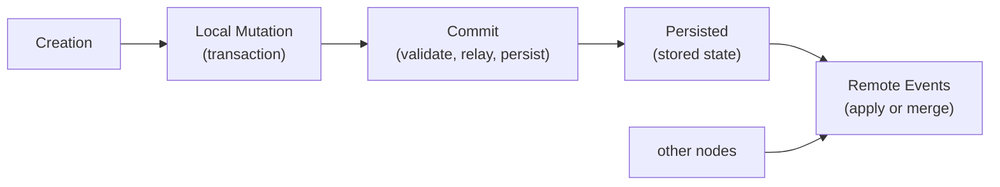

# Entity Lifecycle

## Mental Model

An entity in ankurah is a **replicated, convergent data object**. Its lifecycle
follows four phases:



At every stage, two things determine what happens next:

- The **head clock** -- a set of event IDs recording which events have been
  integrated into the entity's current state.
- The **[event DAG](event-dag.md)** -- which determines whether an incoming
  update extends, duplicates, or conflicts with that state.

Head and [backend](property-backends.md) state are bundled under a single lock
so they are always updated atomically.


## Creation

An entity comes into existence through `Transaction::create()`. This does two
things:

1. **Mints a primary entity** with an empty head and empty backends, registered
   in a node-wide weak set (which guarantees at most one live instance per
   entity ID).
2. **Forks a transactional snapshot** by cloning every
   [backend](property-backends.md#the-propertybackend-trait) and the current
   head. The snapshot is `Transacted` -- it holds a back-pointer to its primary
   but is the only copy the user mutates.

This snapshot isolation means the primary entity stays read-only until commit.
User mutations (setting properties) go through the snapshot's backends, which
accumulate pending operations.

> **System root entities** follow a different path: they are created outside a
> transaction, have their properties set directly, and produce a creation event
> that is immediately applied and persisted. This is the only code path where
> a creation event is applied to the same entity that generated it.


## Local Transaction Commit

When a transaction commits, five phases execute in order:

**1. Generate events.** Each entity's backends are asked for pending operations
(via [`to_operations()`](property-backends.md#the-propertybackend-trait)). These become
an `Event` whose parent is the snapshot's current head. Entities with no
pending operations are skipped. A validation check ensures creation events can
only come from entities that were actually created through the transaction --
preventing "phantom entities."

**2. Fork-based validation.** For each entity/event pair, a second fork is
created as a validation sandbox. The event is
[staged](event-dag.md#the-staging-pattern), applied to the sandbox, and the
resulting before/after state is passed to the policy agent for attestation.
Attested events are committed to storage.

**3. Update heads.** Heads on the transacted entities are updated to include the
new event ID. This happens *before* relaying to peers -- so if a peer echoes the
event back, the local entity already recognizes it as already-integrated.

**4. Relay to peers.** Attested events are sent to
[durable peers](node-architecture.md#durable-vs-ephemeral-nodes). The commit
waits for peer confirmation.

**5. Persist state.** The event is applied to the upstream primary entity (via
`apply_event`), bringing it up to date. The entity's state is serialized and
persisted to storage. Change notifications are emitted to the reactor.


## Remote Event Application

Remote events arrive via `NodeApplier` through two delivery mechanisms (see
[Node Architecture and Replication](node-architecture.md) for the full
protocol):

**Subscription updates** come in two forms:
- *EventOnly* -- the common incremental case.
- *StateAndEvent* -- used for initial subscription delivery and fetch responses.
  The system first tries the fast path: apply the state snapshot directly. If
  that succeeds, done. If the state diverges (concurrent edits exist), it falls
  back to the accompanying events. This two-phase approach ensures events are
  never silently dropped on divergence.

**Delta application** (fetch/query responses) similarly comes as either a
*StateSnapshot* (applied directly) or an *EventBridge* (events connecting the
requester's known head to the responder's).

For every multi-event payload -- *EventOnly*, *StateAndEvent*, and
*EventBridge* alike -- the receiver validates and stages the whole batch, then
topologically sorts it by in-batch parent edges (`event_dag/ordering.rs`) and
applies parents before children. Sender order is not trusted: applying a child
before its staged parent would fast-forward the head past the parent, whose
operations would then be silently dropped as `StrictAscends`.


## How Events Are Applied

`apply_event` is the central integration point, used by both local commit and
remote delivery. It works in two stages: guard checks, then a retry loop.

### Guard Ordering

Three guards execute before the main logic, handling edge cases around creation
events and empty heads:

1. **Creation event on a non-empty head.** On
   [durable nodes](node-architecture.md#durable-vs-ephemeral-nodes) where
   storage is definitive, `event_stored() == true` identifies a re-delivery --
   no-op, while a not-yet-stored event proves different genesis -- reject as
   `Disjoint`. On ephemeral nodes, fall through to BFS which distinguishes
   re-delivery from different genesis.

2. **Creation event on an empty head.** Acquire the write lock, re-check that
   the head is still empty (TOCTOU protection), apply operations, set the head.

3. **Non-creation event on an empty head.** The entity was never created
   properly. Reject with `InvalidEvent` rather than letting BFS produce a
   spurious `DivergedSince(meet=[])`.

### The Retry Loop

After guards pass, `apply_event` enters a bounded retry loop (up to 5
attempts). Each attempt reads the current head, runs
[`compare()`](event-dag.md#comparing-two-clocks) against the event DAG,
and acts on the [`causal relation`](event-dag.md#key-concepts):

| Relation | Action |
|----------|--------|
| `Equal` | Already integrated -- no-op |
| `StrictDescends` | Direct descendant -- apply operations, advance head |
| `StrictAscends` | Event is older than current state -- no-op |
| `DivergedSince` | True concurrency -- compute [event layers](event-dag.md#key-concepts) from the meet point, merge per-backend via [`apply_layer`](property-backends.md#the-propertybackend-trait), update head (remove meet ancestors, insert the event id) so it reflects both tips |
| `Disjoint` | Different lineage -- error |
| `BudgetExceeded` | DAG traversal too deep -- error |

Retries happen when the head moves between comparison and mutation (see
[TOCTOU protection](#toctou-protection) below).


## How State Snapshots Are Applied

`apply_state` handles full state snapshots rather than individual events. It
follows the same compare-then-mutate pattern but **cannot merge divergent
state** -- merging requires the per-operation detail that only events carry
(see [LWW Merge Resolution](lww-merge.md)).

| Relation | Result |
|----------|--------|
| `Equal` | `AlreadyApplied` |
| `StrictDescends` | Replace all backends from snapshot -- `Applied` |
| `StrictAscends` | `Older` |
| `DivergedSince` | `DivergedRequiresEvents` -- caller must fall back to event-by-event application |
| `Disjoint` / `BudgetExceeded` | Error |

When a new state arrives for an entity that may not exist locally yet,
`WeakEntitySet::with_state` handles the lookup: check the in-memory weak set,
then local storage, then create from the incoming state if neither has it.


## TOCTOU Protection

Because DAG comparison is async (and lock-free), the head can move between
comparison and mutation. The `try_mutate` helper serializes this:

```rust
fn try_mutate(&self, expected_head: &mut Clock, body: F) -> Result<bool, E> {
    let mut state = self.state.write().unwrap();
    if &state.head != expected_head {
        *expected_head = state.head.clone();
        return Ok(false);  // head moved -- caller should retry
    }
    body(&mut state)?;
    Ok(true)
}
```

If the head moved, the caller's `expected_head` is updated in place and the
retry loop re-runs comparison against the fresh value. Both `apply_event` and
`apply_state` use this pattern. Retries are bounded to 5 attempts.


## Head Clock Evolution

The head clock evolves through three patterns:

**Linear extension** -- the common case. Head is `[A]`, event `B` arrives with
`parent=[A]`, comparison yields `StrictDescends`, head becomes `[B]`.

**Divergence** -- two events `B` and `C` are created concurrently from `A`.
After applying `B` (head=`[B]`), `C` arrives and comparison yields
`DivergedSince{meet=[A]}`. After layer-based merge, head becomes `[B, C]` --
a multi-element clock indicating concurrent tips.

**Merge** -- event `D` arrives with `parent=[B, C]`, matching the current head
exactly. Head collapses back to `[D]`.


## Persistence Ordering

Events become durable before any canonical state can reference them (see
[The Staging Pattern](event-dag.md#the-staging-pattern) and
[Crash Safety](retrieval.md#crash-safety)). Event append is content-addressed
and idempotent; canonical state, entity-model associations, and every affected
model projection are then committed as one exact-head storage batch.

This gives clean crash recovery semantics:

- Crash after `append_events` but before `commit_batch`: the event is durable
  but unreferenced. Re-delivery is idempotent and can integrate it later.
- A failed or conflicting `commit_batch` exposes none of its canonical,
  association, projection, or index changes.
- A successful `commit_batch` exposes all of those changes together.


## Key Invariants

1. **Atomic head + backend updates.** Both live under a single `RwLock` and are
   always updated together.

2. **TOCTOU protection on every mutation path.** Compare-then-mutate is
   serialized with bounded retries (5 attempts).

3. **Creation event idempotency.** Re-delivery is detected by the durable fast
   path or by BFS (`StrictAscends`). Neither corrupts state.

4. **Transaction snapshot isolation.** The primary entity is not modified until
   commit phase 5.

5. **Staging before comparison; event append before canonical commit.** Events
   must be staged (discoverable by BFS) before `apply_event` is called and
   durably appended before a `commit_batch` can publish a head which references
   them.

6. **StateAndEvent divergence fallback.** When `apply_state` does not apply
   the incoming state (divergence, or the state is older than what the
   receiver has), the applier falls back to event-by-event application.
   Events are never silently dropped on divergence.
